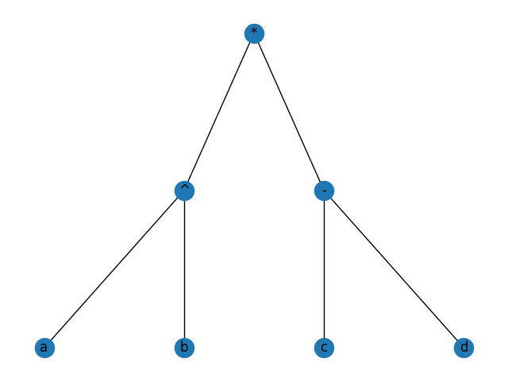

Before running the project, execute this:
```bash
python3 -m virtualenv .venv && source .venv/bin/activate && pip install -r requirements.txt
```
Here's an example:

input:
```
a^b * (c-d)
```
output:
```
Tree: 
parent is: ^ left child is: a right child is: b
parent is: - left child is: c right child is: d
parent is: * left child is: ^ right child is: -
 
Postfix: ab^cd-* 
Prefix: *^ab-cd
Your expression: a^b * (c-d)
Expression type: INFIX
```
tree:


